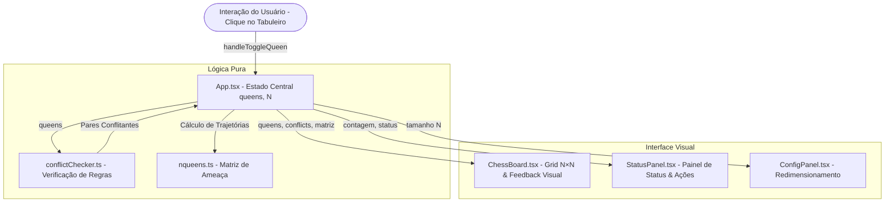

# N-Queens Scholar

Aplicação web interativa para exploração, visualização e resolução do **Problema das N-Rainhas** (N-Queens Problem).

---

## 📌 Sobre o Projeto

O **Problema das N-Rainhas** consiste em posicionar $N$ rainhas em um tabuleiro de xadrez $N \times N$ de modo que nenhuma rainha ameace qualquer outra (ou seja, não compartilhem a mesma linha, coluna ou diagonal).

Esta aplicação foi desenvolvida para fins acadêmicos e educacionais, permitindo:
- **Interação Manual:** Posicione ou remova rainhas clicando nas células do tabuleiro.
- **Detecção de Conflitos em Tempo Real:** Destaque visual instantâneo das rainhas e trajetórias sob ataque.
- **Resolução Automática:** Algoritmo integrado de satisfação de restrições (CSP / Backtracking) que encontra uma solução válida com um clique.
- **Análise & Teoria:** Consulta de complexidade algorítmica, número de soluções conhecidas (OEIS A000170) e conceitos matemáticos.
- **Exportação:** Exportação dos estados em formatos JSON, Matriz ASCII e Vetor.

---

## 🚀 Como Executar

### Pré-requisitos
- Node.js (versão 18 ou superior)
- npm

### Passo a passo

```bash
# 1. Instalar as dependências
npm install

# 2. Iniciar o servidor de desenvolvimento
npm run dev
```

Acesse a aplicação no navegador em **`http://localhost:3000`** (ou na porta indicada no terminal).

---

## 🛠️ Tecnologias Utilizadas

- **React 19 + TypeScript:** Interface e tipagem estática.
- **Vite:** Build tool rápida para desenvolvimento frontend.
- **Tailwind CSS:** Estilização responsiva com tema dark moderno.
- **Lucide Icons:** Conjunto de ícones para a interface.

---

---

## 🏗️ Arquitetura da Aplicação

A aplicação foi estruturada seguindo o princípio de **separação de responsabilidades (SoC)**, garantindo desacoplamento entre a camada de apresentação visual e a lógica do problema (o que facilitará a inserção futura de novos algoritmos de otimização).

```
src/
├── components/
│   ├── ChessBoard.tsx       # Renderização do grid N×N e captura de cliques do usuário
│   ├── StatusPanel.tsx      # Exibição de métricas (Qtd rainhas, conflitos, status e ações)
│   ├── ConfigPanel.tsx      # Controle e ajuste do tamanho N do tabuleiro
│   ├── Header.tsx           # Barra de navegação e atalhos de ajuda/configuração
│   ├── Sidebar.tsx          # Menu de navegação lateral (Analytics, Regras, Exportação)
│   ├── AnalyticsView.tsx    # Métricas de complexidade combinatória e soluções conhecidas
│   ├── TheoryView.tsx       # Explicações teóricas e restrições matemáticas
│   └── [Modais]/            # RulesModal, HelpModal, SettingsModal, ExportModal
├── utils/
│   ├── conflictChecker.ts   # Módulo puro de verificação de conflitos (reutilizável)
│   └── nqueens.ts           # Funções auxiliares, matriz de trajetórias e dados combinatórios
├── types.ts                 # Interfaces e tipos TypeScript centrais (Queen, ConflictPair)
├── App.tsx                  # Componente raiz: orquestração de estado e fluxo de dados
└── main.tsx                 # Ponto de inicialização do React DOM
```

### 1. Representação do Tabuleiro e das Rainhas

As posições das rainhas são mantidas no estado central (`App.tsx`) como uma lista independente da interface gráfica:

```typescript
// Interface central definida em types.ts
export interface Queen {
  row: number; // Linha (0 a N-1)
  col: number; // Coluna (0 a N-1)
}

// Exemplo: Estado no React
const [queens, setQueens] = useState<Queen[]>([]);
```

* **Vantagem arquitetural:** O tabuleiro não armazena strings HTML ou dados de DOM. Qualquer algoritmo futuro poderá ler esse array `Queen[]` ou receber uma matriz simples sem depender de bibliotecas visuais.

### 2. Identificação e Cálculo de Conflitos

A lógica de conflitos está isolada em `src/utils/conflictChecker.ts` por meio de funções puras. Duas rainhas $A$ e $B$ estão em conflito se:

1. **Mesma Linha:** `A.row === B.row`
2. **Mesma Coluna:** `A.col === B.col`
3. **Mesma Diagonal:** `Math.abs(A.row - B.row) === Math.abs(A.col - B.col)`

Ao identificar os conflitos, o `App.tsx` gera uma matriz booleana $N \times N$ de trajetórias de ameaça (`conflictPathMatrix`), permitindo que o `ChessBoard.tsx` destaque tanto as rainhas que estão colidindo quanto os raios de ataque com precisão visual.

---

## 📊 Diagrama Simplificado da Arquitetura



---

---

## 🤖 Uso de Inteligência Artificial

A Inteligência Artificial foi utilizada como ferramenta de apoio durante o desenvolvimento, principalmente para prototipação, implementação, organização do código e revisão da solução.

### Principais etapas e prompts utilizados

1. **Google Stitch — Criação da interface:**
   - Foi solicitado o desenvolvimento do design de uma aplicação web educacional para o Problema das N-Rainhas, especificando o tabuleiro $N \times N$, interação por cliques, identificação visual de conflitos e uma interface moderna e tecnológica.

2. **Antigravity — Análise do projeto:**
   - Foi solicitado que a ferramenta analisasse a estrutura criada pelo Stitch, identificando framework, linguagem, componentes, organização de pastas e possibilidades de reutilização da interface.

3. **Antigravity — Implementação:**
   - Foi solicitado que a aplicação fosse transformada em uma implementação funcional, preservando o design existente e adicionando:
     - Seleção dinâmica de $N$;
     - Inserção e remoção de rainhas;
     - Representação das posições por linha e coluna;
     - Verificação de conflitos em tempo real;
     - Feedback visual de ameaça;
     - Limite máximo de $N$ rainhas.

4. **Antigravity — Refinamentos:**
   - Foram solicitados ajustes finais para garantir que o número máximo de rainhas correspondesse ao tamanho do tabuleiro, limpeza de componentes não utilizados e suporte dinâmico e responsivo a diferentes tamanhos de tabuleiro.